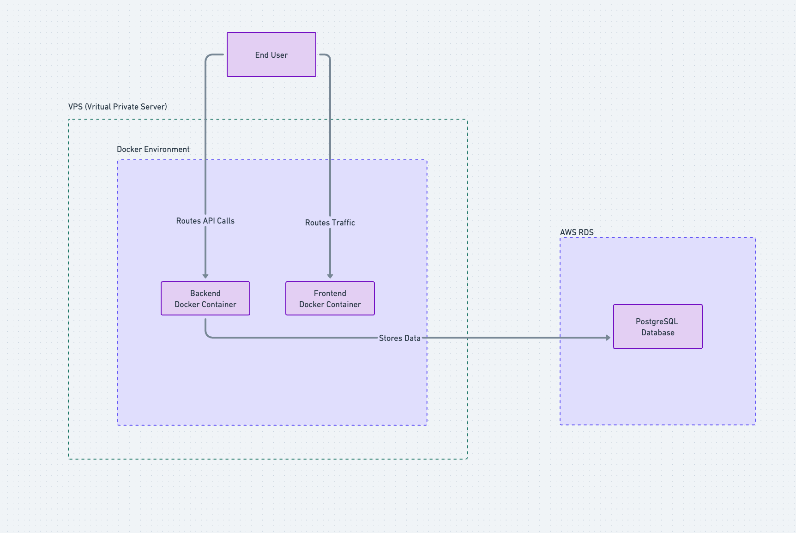

# High-Level Design (HLD) Document

## 1. Overview

### 1.1 Purpose

This document outlines the High-Level Design (HLD) for a web application that enables users to create, list, and filter books by author and genre. The application consists of a frontend, a backend, and a database.

### 1.2 Scope

- Users can create new books by providing details like title, author, genre, ISBN, and publication date.
- Users can view a list of all books.
- Users can filter books by author and genre.
- Users will create the books for pre-defined Authors and Genres.

### 1.3 Out of scope

- Authentication
- Authorization
- User roles
- Book export functionality (PDF/CSV)
- Creating new Authors and Genres

## 2. System Architecture

The system follows a three-tier architecture:

1. **Frontend**: A React-based UI for interacting with the application.
2. **Backend**: A Node.js/Express API for business logic and data processing.
3. **Database**: A PostgreSQL database for storing books, authors and genres.

## 3. Components Design

### 3.1 Frontend

- **Framework:** React (with TypeScript)
- **State Management:** Zustand (or Context API for minimal state needs)
- **UI Library:** Tailwind CSS
- **Key Features:**
  - Book listing with filtering options
  - Book creation form
  - Book update form
  - API communication via axios and react-query

### 3.2 Backend

- **Framework:** Node.js with Express
- **Business Logic:**
  - Validate book creation and update requests
  - Fetch books with filters on author and genre
  - Fetch books with pagination
  - Fetch authors and genres

### 3.3 Database

- **Database:** PostgreSQL
- **Tables:**
  - `books (id, title, author, genre, ISBN, published_at, created_by, created_at)`
  - `authors (id, name, created_by, created_at)`
  - `genres (id, name, created_by, created_at)`

## 4. API Design

| Endpoint | Method | Description |
|----------|--------|-------------|
| `/books` | POST | Creates a new book |
| `/books/:id` | GET | Gets a book by id |
| `/books/:id/logs` | GET | Gets the change logs of a book |
| `/books` | GET | Lists all books |
| `/books?page=:page&limit=:limit` | GET | Lists all books with pagination |
| `/books?authorId=:authorId&genreIds=:genreIds` | GET | Filters books by author and genre |
| `/books?authorId=:authorId&genreIds=:genreIds&genreIds=:genreIds` | GET | Filters books by author and multiple genres |
| `/authors` | GET | Lists all authors |
| `/genres` | GET | Lists all genres |

## 6. Deployment Strategy

- **Frontend**: Deployed via Docker Container in Virtual Machine.
- **Backend**: Deployed via Docker Container in Virtual Machine.
- **Database**: Managed PostgreSQL instance on AWS RDS.

## 9. Conclusion
This document provides a high-level overview of the web application, including its architecture, components, database schema, and API design.